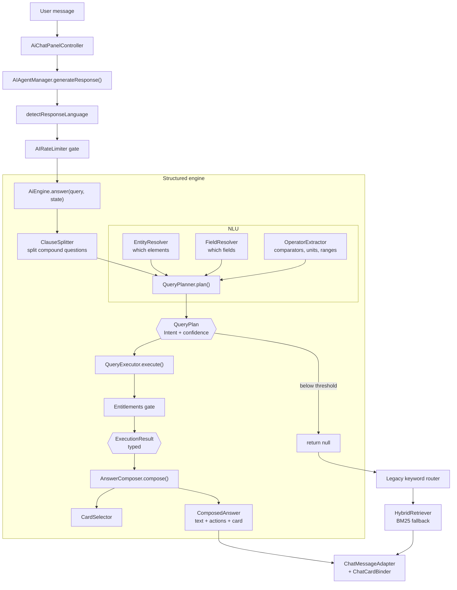

# The AI agent

A natural-language chemistry assistant that runs entirely on the device. It is
the largest subsystem in the app — around 49 source files against 38 test
classes — and it is built to different conventions from the rest of the
codebase.

## It is not a language model

There is no LLM, no API key, no network call in the answer path, and no neural
model of any kind in the repository. What it is instead:

> A deterministic pipeline that resolves entities and fields out of your
> question, builds a **typed query plan**, executes that plan against
> structured element data, and renders the typed result as text.

Every number in an answer traces back to a specific field of a specific element
in `assets/elements_{lang}.json`. Nothing is generated, which is why the
assistant declines rather than guessing when a question falls outside what the
data supports.

The practical payoff: it works offline, it is fast, it cannot hallucinate a
melting point, and it is unit-testable end to end.

## The pipeline

## Stages

**1 — Language detection.** `AIAgentManager.detectResponseLanguage` scores the
message's words against a cross-language element-name map built from all twelve
element files. A higher-scoring language switches the response language and
rebuilds the cached engine.

**2 — Rate limiting.** `AIRateLimiter` enforces the daily message quota (16
free, 64 PRO, unlimited PRO+), keyed to the local calendar day.

**3 — Clause splitting.** `ClauseSplitter` splits genuinely compound questions
("density of gold and how does it compare to lead") — but only when the tail
reads as its own question, not on every conjunction.

**4 — Planning.** `QueryPlanner` — the largest file in the subsystem at ~1,640
lines — runs an ordered cascade of guards and produces a `QueryPlan`: an
`Intent`, entity references, field references, filters, operators, and a
confidence. Below the confidence threshold it returns nothing and the engine
declines.

**5 — Execution.** `QueryExecutor` has one method per intent, reads values from
`KnowledgeStore`, and returns a typed `ExecutionResult`. Entitlements are
checked *before* any value is read, so a locked field's value never enters the
pipeline.

**6 — Composition.** `AnswerComposer` renders the typed result into markdown,
attaches citations as deep-link chips, and asks `CardSelector` for a visual —
derived from the typed result, never from the query text.

**7 — Fallbacks.** If the structured engine declines, control falls to a legacy
keyword router in `AIAgentManager` (trends, reactivity, etymology, quiz,
greetings), and finally to `HybridRetriever` — BM25 over a runtime-built corpus.

## Intents

`ai/core/QueryPlan.kt` defines 17:

`PROPERTY_LOOKUP` · `CATEGORY_LOOKUP` · `COMPARISON` · `SUPERLATIVE` ·
`FILTER_LIST` · `AGGREGATE` · `ISOTOPES` · `SAFETY` · `EMISSION_SPECTRUM` ·
`FORMULA_MASS` · `NUCLIDE_COUNT` · `ISOTOPE_COMPARISON` · `COMPARATIVE` ·
`NEIGHBOUR` · `MOLE_CONVERSION` · `DATASET_LOOKUP` · `UNKNOWN`

## Design decisions that recur

**Absence is modelled, not signalled.** `FieldValue.Missing`,
`ExecutionResult.NoData`, `ExecutionResult.Locked`, `ExecutionResult.Empty` are
distinct types. The composer says something different for each, because "we
don't have that", "that doesn't exist for this element" and "that needs PRO" are
different answers.

**No Android in the core.** Localisation goes through the `StringProvider`
interface, so the whole engine can be constructed with a `FakeStrings` double
and tested on the JVM without a `Context`.

**No `org.json`.** Under JVM unit tests `org.json` is a stub whose methods
throw. The data layer works in plain Kotlin maps and exactly one class,
`AssetElementSource`, touches JSON. The same constraint is why `ChatActionCodec`
and `ChatCardCodec` use a control-character record format rather than JSON.

**Cards carry references, not data.** A `ChatCard` is a kind plus an element key
plus a title. A 42-isotope chart costs about thirty bytes on the message instead
of two kilobytes — which matters because chat sessions are persisted through
Firestore.

**Confidence gating over best-effort.** A low-confidence plan is discarded. The
engine would rather decline than answer a question it has misunderstood.

## Pages in this section

| Page | Covers |
|:--|:--|
| [Architecture](architecture) | Full technical reference for the manager, personality, rate limiter, knowledge managers |
| [NLU](nlu) | Lexicon, entity resolution, field resolution, operator extraction, clause splitting |
| [Data layer](data-layer) | FieldRegistry, ValueParser, Quantity, UnitConverter, KnowledgeStore, DatasetIndex |
| [Retrieval](retrieval) | Tokeniser, BM25, HybridRetriever — and why embeddings were removed |
| [Chat cards](cards) | The eight card kinds and how they are selected and bound |
| [The corpus](corpus) | The evaluation corpus and what it caught |
| [Translation review](translation-review) | Machine-translated queries flagged for native review |
| [Extending](extending) | Adding a field, a language, a card, a dataset |

## Known limitations

**Reference datasets are English-only.** Constants, equations, the dictionary,
ions, indicators, the electrode series, solubility, geology and alloys are not
translated. A foreign-language question about them is glossed to English for
searching (`Lexicon.DATASET_GLOSS`) and answered in the user's language, but the
table content stays English.

**One network dependency.** The emission-spectrum card loads a pre-rendered GIF
from `jlindemann.se`. It is the only remote call in the subsystem, it is an
image rather than data or inference, and `ChatCardPolicy.allowNetworkCards`
withholds that card in offline mode.

**Two engines coexist.** The legacy keyword router in `AIAgentManager` still
handles trends, reactivity, etymology, greetings and quiz interactions that the
structured engine deliberately declines (`Lexicon.DEFER_TO_PERSONALITY`,
`UNBACKED_CONCEPTS`). It is not dead code.
