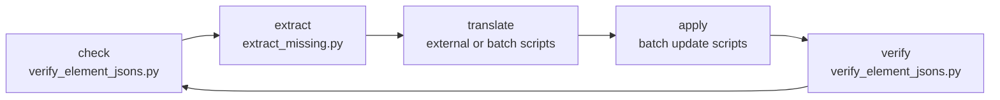

# Data pipeline

The Python tooling in `scripts/` that maintains the element JSON files and the
Android string resources.

These are maintenance scripts run by hand, not a build step. Nothing in
`app/build.gradle` invokes them, and the app builds from the committed data.

## Requirements

Python 3.6 or later. **Standard library only** — the scripts detect the
repository root themselves and can be run from any directory.

```bash
python3 scripts/verify_element_jsons.py
```

(The `requirements.txt` that used to sit here listed `sentence-transformers` and
`numpy` for the abandoned embedding pipeline, and has been removed along with
it. See [Project history](../development/history#the-abandoned-embedding-experiment).)

## Why the tooling exists

Element data lives in twelve files of ~32,000 lines each. Every field is
duplicated across all twelve, and only seven fields legitimately differ between
them. Hand-editing is not viable: a change to one element's density has to land
identically in twelve places, and a typo in one of them produces a value that is
wrong in exactly one language.

So: scripts write the data, and a verifier checks the twelve files stayed
consistent.

## The loop



```bash
# 1. Where are we?
python3 scripts/verify_element_jsons.py --detailed
python3 scripts/check_translations.py

# 2. What's missing?
python3 scripts/extract_missing.py     # → untranslated_strings.csv

# 3. Translate — externally, or with a batch script

# 4. Verify
python3 scripts/verify_element_jsons.py
```

## Pages

| Page | Covers |
|:--|:--|
| [Element data](element-data) | Populating and verifying the element JSON |
| [Translations](translations) | The translation scripts and workflow |

## A note on the script inventory

`scripts/` holds 30-odd Python files, and a lot of them overlap. Names like
`push_toward_60.py`, `push_60_plus.py`, `continue_toward_65.py` and
`push_toward_70.py` are successive one-off passes from a translation campaign,
each written to raise a completion percentage past a particular mark.

They are kept because they encode the actual translations applied, but they are
**historical artifacts, not a maintained toolkit**. For new work use the small
set documented on the following pages:

- `verify_element_jsons.py` — the authoritative checker
- `populate_element_data.py` — filling element fields
- `extract_missing.py` — exporting untranslated strings
- `check_translations.py` — interface string status

Everything else is best read as a record of what was done.
