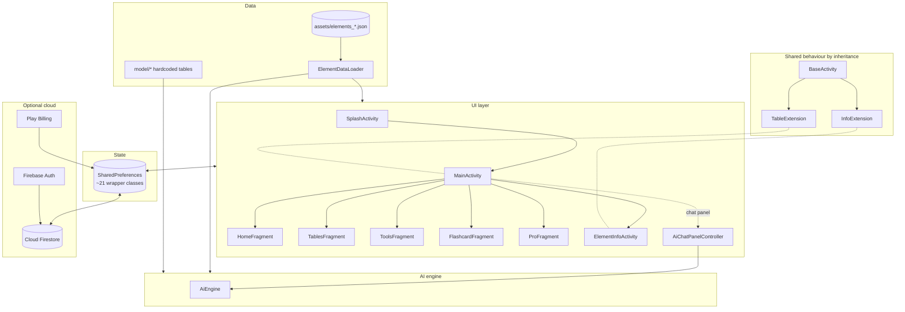

# Architecture

## The shape of it

## Decisions that shape the code

This codebase makes several choices that are unusual for its size. They are
described here plainly, not defended — knowing them saves you looking for
structure that is not there.

### No dependency injection

There is no Dagger, Hilt or Koin. Objects are constructed where they are used.
`RetrievalService` is a hand-rolled process-wide singleton; everything else is
instantiated per-activity.

### No ViewModels, no lifecycle-aware state holders

State that must survive configuration changes is either in SharedPreferences or
re-derived on recreate. `LearningGamesActivity` opts out of recreation entirely
by declaring `configChanges` for orientation in the manifest.

### No Room, no database

There is no local database of any kind. Bulk data is read from assets; user
state is SharedPreferences; cloud state is Firestore documents.

### Shared behaviour comes from inheritance

Three base classes carry what would elsewhere be delegates or composed helpers:

**`activities/BaseActivity.kt`** is the root of nearly every activity. It
provides:

- Locale wrapping in `attachBaseContext` (via `utils/LocaleUtil`), which is what
  makes in-app language switching work
- Firebase and Firestore initialisation, including offline persistence
- Edge-to-edge window insets, exposed to subclasses through the template method
  `onApplySystemInsets(top, bottom, left, right)`
- Achievement-toast checking on resume
- Firebase Analytics screen-view logging
- Theme-attribute colour resolution (`getColorFromAttr`)
- `goToProPage()`

**`extensions/TableExtension.kt`** extends `BaseActivity` and is extended by
`MainActivity`. It holds the periodic-table colouring and search helpers.

**`extensions/InfoExtension.kt`** extends `BaseActivity` and is extended by
`ElementInfoActivity`. At around 1,160 lines it is the largest of the three — a
collection of element-detail view lookups, formatting and panel management.

**`fragments/BaseFragment.kt`** is a thin base that casts to the hosting
`MainActivity` and forwards `onApplySystemInsets`.

### ViewBinding is enabled but unused

`app/build.gradle` sets `viewBinding true`, but no `*Binding` classes are
referenced anywhere — the code uses `findViewById` throughout. The flag costs a
little build time and nothing else. If you are adding a screen, follow the
surrounding `findViewById` style for consistency rather than introducing a
second convention in one file.

### Overlays instead of navigation

`MainActivity` layers several panels over the table as `<include>`d views that
fade in and out — the hover menu, the search panel, the filter box, the PRO
popup, and the AI chat panel — rather than pushing them as destinations. This is
why back handling needs an explicit priority chain rather than a back stack.
See [UI patterns](ui-patterns).

## The AI engine is architecturally separate

The `ai/` package is the one part of the codebase built to different
conventions, and deliberately so. It has:

- A clean layering: NLU → planning → execution → composition, with typed
  results between each stage
- No Android dependencies in its core — localisation goes through a
  `StringProvider` interface so the engine can be constructed with a
  `FakeStrings` double and tested on the JVM
- Explicit modelling of absence (`FieldValue.Missing`, `ExecutionResult.NoData`)
  rather than sentinel strings or nulls
- Around 40 unit test classes, against roughly 40 source files

It reads the same `assets/elements_{lang}.json` files as the UI, through the
same `ElementDataLoader`, but parses them into its own typed index rather than
sharing the UI's representation.

See the [AI Agent](../ai) section.

## Threading

Coroutines are used sparingly and directly — no structured concurrency
framework. `ElementDataLoader` caches parsed JSON in a `ConcurrentHashMap`
specifically because it is read from the IO dispatcher during AI engine
initialisation and from the main thread by the UI.

## What this architecture costs

Worth stating honestly, since it affects how you should approach changes:

- Business logic in activities is hard to unit test, which is why test coverage
  is concentrated almost entirely in `ai/` and `quiz/` (see [Testing](testing)).
- The large `InfoExtension` base class means element-detail changes touch a file
  shared by everything on that screen.
- SharedPreferences-per-feature means ~21 small classes and no single place to
  see all persisted state.

None of this is blocking, and the app works. But if you are adding something
substantial, the `ai/` package is the better model to follow.
